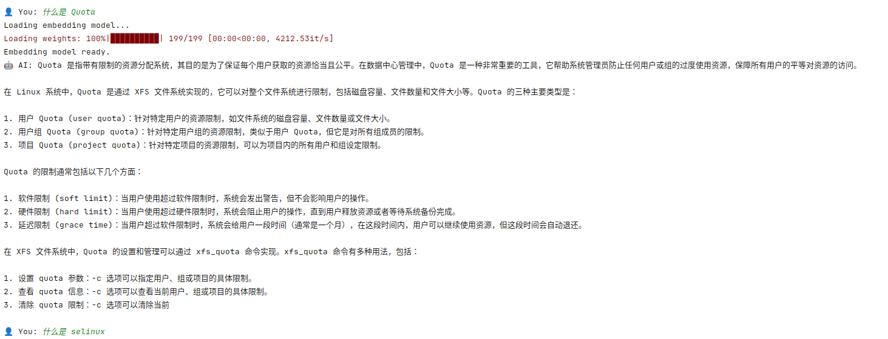

### **Rag_Without_Encapsulation: 基于本地知识库的 Linux 运维问答助手**

**rag_without_encapsulation** 是一个轻量级、完全离线的检索增强生成（RAG）系统。它能够利用你提供的 PDF 格式的 Linux 技术文档（如《鸟哥的Linux私房菜》），回答用户关于 Linux 系统运维、命令使用和概念理解的问题。所有计算均在本地完成，保障数据隐私与安全。

  


#### **核心特性**

- **完全离线**: 无需联网，所有模型推理和向量检索均在本地进行。
- **精准问答**: 利用 RAG 技术，让大语言模型（LLM）的回答严格基于你提供的技术文档，有效减少“幻觉”。
- **轻量高效**: 默认集成微软的 `Phi-3-mini-4k-instruct` 模型，在消费级硬件上也能流畅运行。
- **易于扩展**: 只需将新的 PDF 文档放入指定文件夹，即可轻松扩展知识库。

#### **快速开始**

##### **1. 克隆仓库**

bash
```
git clone https://github.com/darlingshall/Rag_Without_Encapsulation.git
cd Rag_Without_Encapsulation
```

##### **2. 安装依赖**

建议使用 Python 虚拟环境 (`venv` 或 `conda`)。

bash
```
# 创建并激活虚拟环境 (可选但推荐)
conda create -n AI python=3.10
conda activate AI

# 安装依赖
pip install -r requirements.txt
```

##### **3. 准备知识库**

将你的 PDF 格式 Linux 技术文档放入 `docs/` 目录下。

bash
```
mkdir docs
cp /path/to/your/linux_book.pdf docs/
```

##### **4. 运行应用**

首次运行时，程序会自动加载并处理 `docs/` 目录下的所有 PDF 文件，构建本地向量数据库。

bash
```
python rag_agent.py
```

启动后，按照提示输入你的问题即可！

#### **配置说明**

本项目的主要配置项位于 `config.py` 文件中，你可以根据需要进行调整：

- **`MODEL_NAME`**: 使用的本地 LLM 模型名称，默认为 `"microsoft/Phi-3-mini-4k-instruct"`。
- **`EMBEDDING_MODEL_NAME`**: 使用的本地 EMBEDDING 模型名称，默认为 `"models--sentence-transformers--paraphrase-multilingual-mpnet-base"`。
- **`DOCS_PATH`**: PDF 文档存放的目录路径。
- **`VECTOR_DB_PATH`**: 本地向量数据库的存储路径。

#### **项目结构**

文本

编辑

```
my_rag_system/
├── agent/
│   └── rag_agent.py
├── config.py                                      # 项目配置文件
├── data/
│   ├── chroma.sqlite3
│   └── d59458cf-4158-4711-b067-cf3725887527/
│       ├── data_level0.bin
│       ├── header.bin
│       ├── index_metadata.pickle
│       ├── length.bin
│       └── link_lists.bin
├── loaders/
│   └── pdf_loader.py
├── main.py                                        # 主程序入口
├── models/
│   ├── embeddings.py
│   └── llm.py
├── README.md
├── requirements.txt                              # Python 依赖列表
└── vectorstore/
    └── chroma_store.py

```

#### **致谢**

- 感谢 [LangChain](https://www.langchain.com/) 提供强大的 LLM 应用开发框架。
- 感谢 [Hugging Face](https://huggingface.co/) 提供优秀的开源模型和工具。
- 特别感谢《鸟哥的Linux私房菜》等优秀技术书籍的作者。
